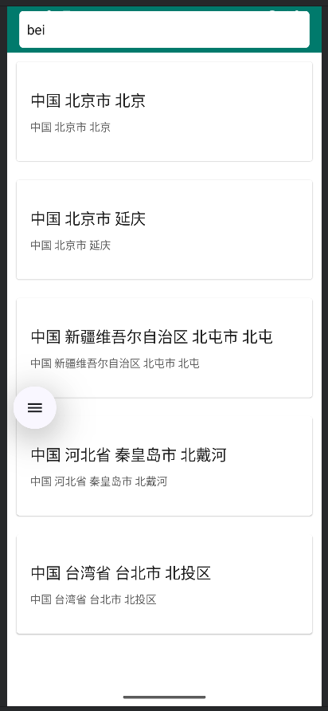

# Skynow 🌤️

⚠️ 注意：该项目仍在开发阶段，功能可能随时调整或更新。

Skynow 是一个 Android 天气应用程序，用户可以通过搜索城市名称来获取相关的天气信息。

项目遵循 MVVM 结构，使用彩云 API 获取实时天气数据，并使用 Retrofit 进行网络请求，界面采用传统 XML 布局实现。

功能特点：

- [x] 🌐 根据城市名称获取实时天气数据
- [x] 📍 显示当前天气信息，包括温度、湿度、天气状况
- [ ] 🔄 刷新数据，获取彩云 API 提供的最新信息

项目截图：

  

